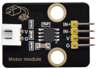
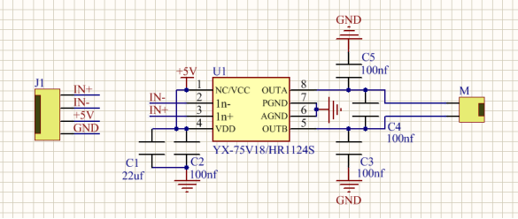
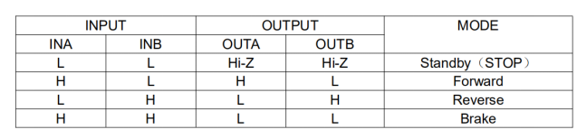

# KS0347 Keyestudio 130 Motor DC3-5V Driving Module



## 1. Description

This pump driving module uses a single-channel H-bridge driver chip-HR1124S. 

The H-bridge driving part of HR1124S uses low on-resistance PMOS and NMOS power tubes, which can reduce chip’s power consumption and make the chip work safely for a longer time. In addition, HR1124S has low standby current and low quiescent operating current.

## 2. Parameters

Control chip: HR1124S Rated voltage: 1.8V-6.8V Rated current: low standby current (0.01uA) and low quiescent working current (0.2mA), continuous output current 1.2A. Product size: 31.6mmx23.7mm Operating temperature range: 1°C ~ 50°C.

## 3. Schematic Diagram



## 4. Control Logic

Input and output logic table



PWM can regulate the speed of the motor, for example, in clockwise, INA is high level and INB is low level, the rotation speed is the fastest.

If INA inputs PWM wave, and INB also maintains low level; the duty cycle of INA is the speed regulation ratio.

If INA keeps high levels and INB inputs PWM wave; the duty cycle of INB is the speed regulation ratio.

## 5. Connection Diagram

| Pin  | Description        |
| ---- | ------------------ |
| IN+  | PWM signals output |
| IN-  | PWM signals output |
| V    | 3.3V/5V            |
| G    | Ground             |


## 6. Test Code

Download code : [Code](./Code.7z)

Test Code 1

```c
void setup()
{
  pinMode(5, OUTPUT);//Set digital 5 to Output
  pinMode(6, OUTPUT);//Set digital 6 to Output
}

void loop()
{
	//make the motor rotate clockwise for 3000ms
    digitalWrite(5,LOW);//set digital 5 to low level
    digitalWrite(6,HIGH);//set digital 5 to high level
    delay(3000);//delay in 3s
    //make motor stop rotating for 1000ms 
    digitalWrite(5,LOW);
    digitalWrite(6,LOW);
    delay(1000);
    //make the motor rotate anticlockwise for 3000ms
    digitalWrite(5,HIGH);
    digitalWrite(6,LOW);
    delay(3000);
    //make motor stop rotating for 1000ms
    digitalWrite(5,LOW);
    digitalWrite(6,LOW);
    delay(1000);
}
```

Test Code 2

```c
void setup()
{
    pinMode(5, OUTPUT); //Set digital 5 to Output
    pinMode(6, OUTPUT); //set digital 6 to OUTPUT
}

void loop()
{
	//make the motor rotate clockwise for 3000ms
  	analogWrite(5,0); //set PWM value at digital 5 to 0
  	analogWrite(6,200); //set PWM value at digital 6 to 200
  	delay(3000); //delay in 3s
	//make motor stop rotating for 1000ms
    analogWrite(5,0);
    analogWrite(6,0);
    delay(1000);
    //make the motor rotate anticlockwise for 3000ms
    analogWrite(5,200);
    analogWrite(6,0);
    delay(3000);
    //make the motor stop rotating for 1000ms
    analogWrite(5,0);
    analogWrite(6,0);
    delay(1000);  
}
```

## 7. Test Result

Upload code, wire up and plug in the external power. The motor rotates for 3s clockwise, stops for 1s, anticlockwise for 3s and stops for 1s, circularly.